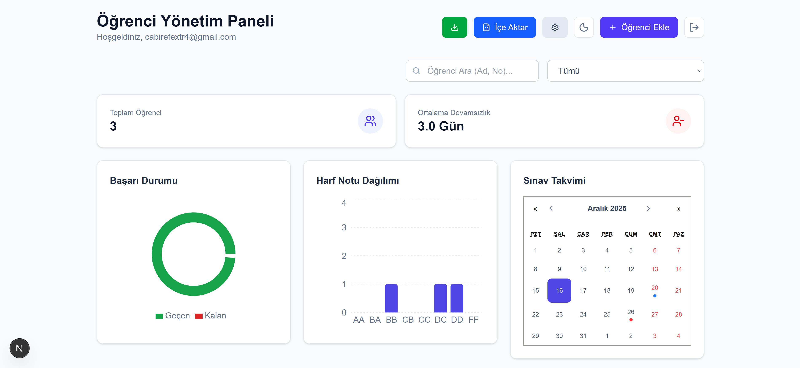

# Öğrenci Yönetim Paneli

Bu proje, öğrencilerin akademik durumlarını, sınav takvimlerini ve notlarını takip etmek için geliştirilmiş modern bir web tabanlı yönetim panelidir. **Next.js** ve **Firebase** teknolojileri kullanılarak geliştirilmiştir.

## 🚀 Özellikler

* **Dashboard:** Genel istatistikler ve KPI kartları ile hızlı bakış.

* **Öğrenci Yönetimi:** Öğrenci listesi görüntüleme, ekleme ve detaylı bilgi panelleri.
* **Not Takibi:** Sınav notlarının girişi ve grafiksel başarı analizleri.
* **Sınav Takvimi:** Yaklaşan sınavların ve etkinliklerin takibi.
* **Güvenli Altyapı:** Firebase Authentication ve Firestore veritabanı entegrasyonu.

## 🛠️ Kurulum ve Çalıştırma

Projeyi kendi bilgisayarınıza kurmak için aşağıdaki adımları sırasıyla uygulayın.

### 1. Repoyu Klonlayın
Terminali açın ve projeyi indirin:

```bash
git clone [https://github.com/Luvenita/ogrenci-yonetim-paneli.git](https://github.com/Luvenita/ogrenci-yonetim-paneli.git)
cd ogrenci-yonetim-paneli
2. Bağımlılıkları Yükleyin
Gerekli paketleri indirmek için:

Bash

npm install
# veya
yarn install
3. ⚙️ Firebase Ayarlarını Yapılandırma (Önemli Adım)
Güvenlik nedeniyle projenin gerçek API anahtarları (API Keys) bu repoda bulunmamaktadır. Projeyi çalıştırabilmek için kendi Firebase bilgilerinizi girmelisiniz:

Proje klasöründeki lib klasörüne gidin.

Burada firebase.example.js adında bir dosya göreceksiniz.

Bu dosyanın adını firebase.js olarak değiştirin (veya kopyasını oluşturup adını değiştirin).

Oluşturduğunuz firebase.js dosyasını açın ve içerisindeki API_KEY, PROJECT_ID gibi alanları kendi Firebase konsolunuzdan aldığınız bilgilerle doldurun.

Not: firebase.js dosyası .gitignore listesinde olduğu için, girdiğiniz şifreler GitHub'a yüklenmez, güvende kalır.

4. Uygulamayı Başlatın
Her şey hazırsa geliştirme sunucusunu başlatın:

Bash

npm run dev
Tarayıcınızda http://localhost:3000 adresine giderek uygulamayı görüntüleyebilirsiniz.

Geliştirici: Luvenita